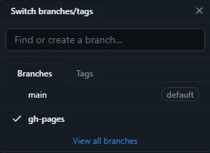
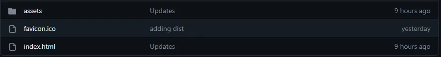

# ELEC0139 Blog - Bridging the Data Gap: Leveraging AI to Address Data Scarcity in Medical Imaging

[](https://github.com/yushiran/ELEC0139_BLOG_SN24076607/stargazers)
[](https://github.com/yushiran/ELEC0139_BLOG_SN24076607/network/members)
[](https://github.com/yushiran/ELEC0139_BLOG_SN24076607/watchers)
[](https://github.com/yushiran/ELEC0139_BLOG_SN24076607/issues)
[](https://github.com/yushiran/ELEC0139_BLOG_SN24076607/blob/main/LICENSE)
[](https://github.com/yushiran/ELEC0139_BLOG_SN24076607/commits/main)

## Visit the blog: [https://yushiran.github.io/ELEC0139_BLOG_SN24076607/](https://yushiran.github.io/ELEC0139_BLOG_SN24076607/)
<div align="center">
    
</div>

## About This Blog

This blog explores advanced AI/ML solutions to address data scarcity challenges in medical imaging. The website discusses three key approaches:

1. **Self-Supervised Learning (SSL)** - Leveraging unlabeled medical image data through context restoration strategies
2. **Reinforcement Learning (RL)** - Learning optimal behaviors with minimal dependence on annotated data
3. **Generative Models** - Using GANs and diffusion models to synthesize realistic medical images

The blog also addresses ethical considerations including data privacy, bias, transparency, and governance related to AI in medical imaging.


## How to Deploy This Vue Blog on GitHub Pages

This project is built with Vue 3 and Vite and deployed on GitHub Pages. Here's a step-by-step guide to deploy your own:

> This deployment guide is adapted from [this article by MKay11](https://mkay11.medium.com/how-to-deploy-your-vite-vue-3-application-in-github-pages-2023-2b842f50576a)

### Step 1: Set up your GitHub Repository

Create a repository on GitHub and push your local code:

```sh
git remote add origin <REMOTE_URL>
git remote -v
git push origin main
```

### Step 2: Configure Your Vue App for GitHub Pages

#### Init The Vue Project
```sh
# init the vue project first
npm init vue@latest
```

#### Add Base Public Path

Since GitHub Pages serves your site from a subfolder (your repository name), configure the base path in `vite.config.js`:

```js
export default defineConfig({
  base: "/your github repo name/",
  plugins: [vue()],
  // other configuration...
})
```

This ensures all asset paths are correctly prefixed with your repository name in production.

[official Vite documentation for GitHub Pages deployment](https://vite.dev/guide/static-deploy.html#github-pages).


### Step 3: Set Up Deployment Scripts

Install the gh-pages package to simplify deployment:

```sh
npm install gh-pages --save-dev
npm install
```

Add deployment scripts to your `package.json`:

```json
"scripts": {
  "dev": "vite",
  "build": "vite build",
  "predeploy": "npm run build",
  "deploy": "gh-pages -d dist"
}
```

Now, you can run these commands to push up your /dist into a new or existing gh-pages branch:
```sh
npm run build
git subtree push --prefix dist origin gh-pages
```
You should see the branch come up in your repository like so:
<div align="center">
    
</div>

and if you take a look at the branch’s files you will find the contents of `/dist`:
<div align="center">
    
</div>


### Step 4: Configure GitHub Pages Settings

1. Go to your GitHub repository
2. Navigate to Settings → Pages
3. Under "Build and deployment":
   - Set Source to "Deploy from a branch"
   - Select the "gh-pages" branch
   - Save your changes

### Step 5: Deploy Your Site

Run the deployment command:

```sh
# Start the development server
npm run dev
```

```sh
# Build for prodection
npm run build

# Deploy to Github Pages
npm run deploy
```

This builds your project and pushes the compiled files to the gh-pages branch, triggering a deployment.

### Step 6: View Your Live Site

Your site will be available at `https://<USERNAME>.github.io/<REPOSITORY-NAME>/`